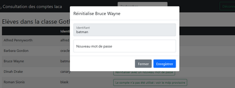

# Serveur Web Mdp-Iaca

_Serveur offrant une interface web permettant la réinitialisation du mot de passe d’un élève, dans un environnement IACA._




## Ressources matérielles

utilise un serveur linux sur lequel est installé docker.


## Configuration du serveur IACA

_Extrait de la doc IACA: https://www.iacasoft.fr/outils/TCPComIACA/index.htm_

Afin de ne pas permettre à n'importe quel serveur Web de lire les mots de passe de IACA ou de les modifier, vous devez indiquer dans la base de registre du serveur IACA l'adresse IP du ou des serveurs Web autorisés.

* Si votre serveur est en 64 bits : Placez-vous dans HKEY_LOCAL_MACHINE\SOFTWARE\WOW6432Node\Sayer\IACA

Créez une valeur chaîne nommée IPMdpWeb et donnez comme valeur l'adresse IP du serveur Web à autoriser. Si vous avez plusieurs adresses à indiquer, séparez-les par un point-virgule. Ne mettez pas d'espace. Il est inutile de redémarrer le service IACA, la modification est prise en compte immédiatement.

Si plus tard, vous ne voulez plus autoriser des serveurs Web, supprimez les adresses IP correspondantes.


### Configuration dans l'AD

Dans l'AD, ajouter un compte utilisateur, nommé __________ , membre du groupe "opérateur de comptes".

> todo: utiliser une delegation de droits plutot le groupe pour que pingcastle soit content.

Le renseigner dans le fichier de config, au champ `AD_UserGest`. Il sera utilisé par l'appli pour forcer le mot de passe a être changé a la prochaine connexion.

## Installation de l'application

Télécharge l’appli avec l’outil git dans le dossier `/docker/mdp-iaca` et la démarrer :

```bash
cd /docker/mdp-iaca
docker compose up -d
```

> TODO a reécrire, les fichiers ont été déplacés

En première installation, le fichier `./inc/user_config.php` n'existe pas. Il faut se connecter à l'interface web en `admin` avec le mdp `admin` pour le créer via la page de configuration.


## Utilisation

L’utilisateur pointe son fureteur sur l’adresse https://srv-mdpiaca:4343.
Il choisit sa classe, puis clique sur le bouton reset en face du nom de l'élève.

Techniquement :
- La connexion s’effectue vers le serveur Mdp avec un chiffrement SSL.
- Le serveur Mdp obtient la liste d’élèves depuis le serveur IACA par le protocole LDAP.
- Lors du changement de mot de passe, le serveur Mdp l’envoie au serveur IACA via la commande TcpCom.

L'appli dispose de 3 niveaux d'accès (configurable):
- un mode élève. Il peut seulement changer son mot de passe, avec une bafouille pour expliquer comment en choisir un, et aussi voir son identifiant ENI.
- un mode prof. Ils peuvent réinitialiser le mdp d'un élève en 2-3 clics. + la page pour modifier le leur.
- un mode admin. Pour reconfigurer l'appli, voir le journal des actions utilisateurs, et lister les comptes élèves inactifs.


### Petit panda roux

Réglage à effectuer dans la GPO de configuration du navigateur Firefox.

* Pour ne pas passer par le proxy :

Entre **srv-mdpiaca** dans le champ **No proxy for**, sous
_Configuration ordinateur > modèle administration > mozilla firefox > Paramètres du proxy_

* Pour éviter l’alerte de sécurité lié au certificat auto-signé :

Se connecter à l’adresse https://srv-mdpiaca:4343, cliquer sur **afficher le certificat** pour l’enregistrer sous
`\\NomDuDomaine.local\NetLogon\srv-mdpiaca.pem`

Ensuite, sous _Configuration ordinateur > modèle d’administration > mozilla firefox > Certificates_ ouvre **Installation des Certificats**, coche **Activé**, clique sur **Afficher…** et renseigne la valeur :

```
\\NomDuDomaine.local\NetLogon\srv-mdpiaca.pem
```

## Notes

La page affiche "Le compte n'a été utilisé" alors que ce n'est pas le cas :

> L'appli interroge l'attribut "logoncount" dans l'active directory.
> Cet attribut n’est pas répliqué et est conservé sur chaque contrôleur de domaine du domaine.
> Pour obtenir une valeur précise pour le nombre total de tentatives d’ouverture de session réussies de l’utilisateur dans le domaine, chaque contrôleur de domaine du domaine doit être interrogé et la somme des valeurs doit être utilisée.
> *Source : https://docs.microsoft.com/fr-fr/windows/win32/adschema/a-logoncount*

